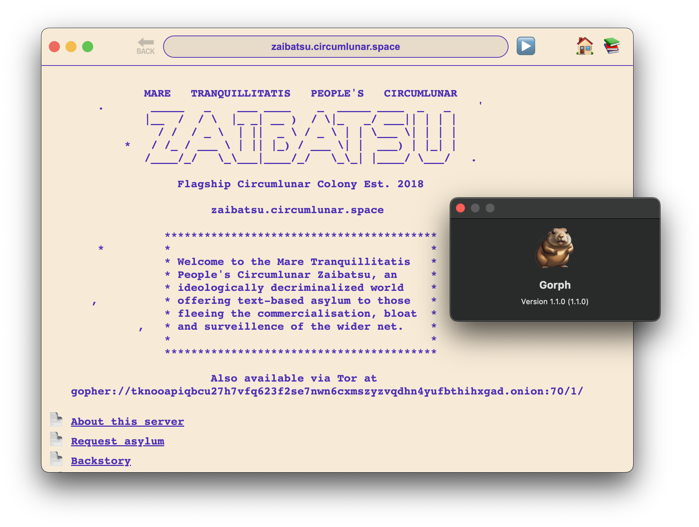

# gorph v1.2.1
## another gopher browser with a gui

yeahhh it's a gopher browser made with web tech (html, css, js). yeahhh that might be dumb, but whatever. yeahhh it's an electron app so it's 200 MB. yeahhh that might be dumb, but whatever. it does the "job". it's "multiplatform". just sit back, relax, and enjoy the gopher space !

### features:

- the usual gopher stuffs
- homepage
- bookmarks
- some keyboard shortcuts

### roadmap:

- [x] history
- [ ] url auto-complete suggestions from history
- [ ] settings menu
- [ ] more themes
- [ ] tabs ???
- [ ] experimental markdown type support
- [ ] better downloads system ???
- [ ] windoze build
- [ ] sign mac build
- [ ] web proxy ???
- [ ] font choices ???
- [ ] gemini support ??? (eek!)
- [ ] cordova ???
